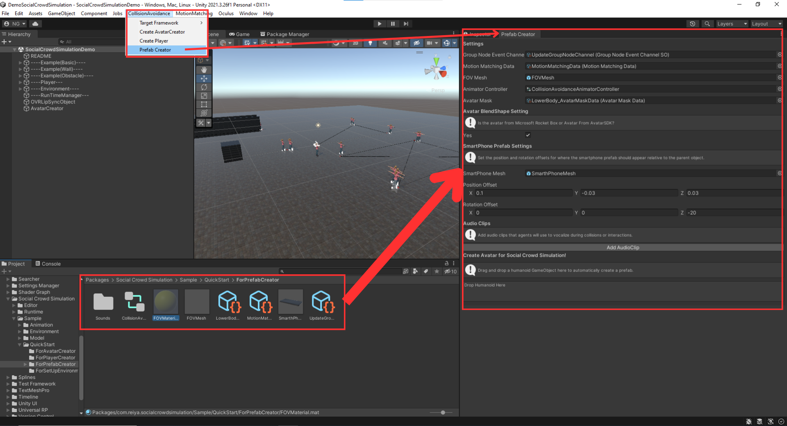
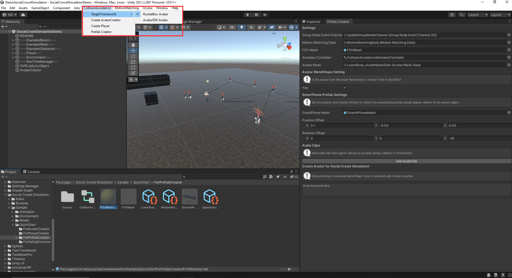
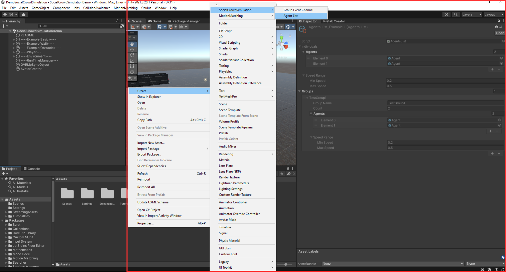
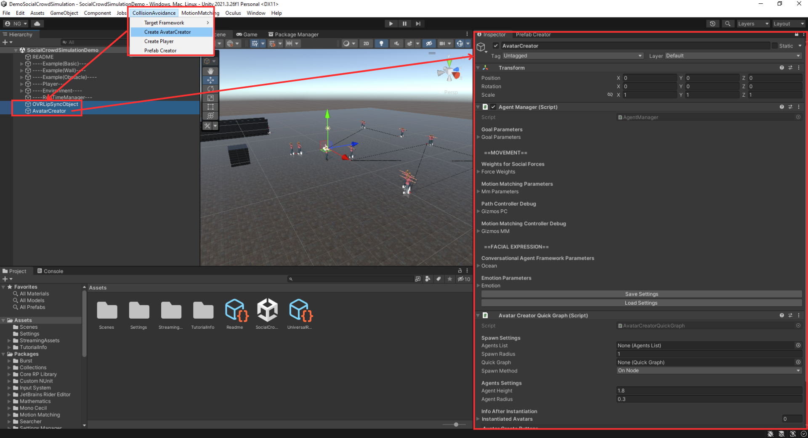
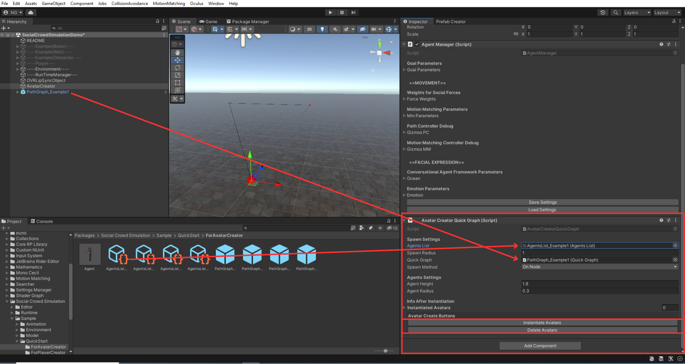

# Social Crowd Simulation: Improving Realism with Social Rules and Gaze Behavior(MIG2024, C＆G2025)

Welcome to the **Social Crowd Simulation: Improving Realism with Social Rules and Gaze Behavior** repository. This system simulates dynamic pedestrian movement by integrating various social and physical forces. Agents will:

- Steer toward their goals
- Avoid collisions
- Form natural groups
- Realistic Attention Model
- Natural Animation by [motion matching](https://github.com/JLPM22/MotionMatching)

For a detailed overview and demo, visit the [Project Page](https://reiyaitatani.github.io/SocialCrowdSimulation/).
For the paper, [MIG2024](https://dl.acm.org/doi/10.1145/3677388.3696337), [Computers & Graphics 2025](https://www.sciencedirect.com/science/article/pii/S009784932500127X)


---

## Table of Contents
1. [Prerequisites](#prerequisites)
2. [Installation](#installation)
3. [Quick Start: Demo Scene Setup](#quick-start-demo-scene-setup)
   1. [Step 0. Prepare a Humanoid Character for Social Crowd Simulation](#0-prepare-a-humanoid-character-for-social-crowd-simulation)
   2. [Step 1. Define the Crowd to be Spawned in the Scene](#1-define-the-crowd-to-be-spawned-in-the-scene)
   3. [Step 2. Create the GameObjects Required for Avatar Creation](#2-create-the-gameobjects-required-for-avatar-creation)
   4. [Step 3. Path Setup and Agent Instantiation](#3-path-setup-and-agent-instantiation)
   5. [Step 4. Run the Simulation](#4-run-the-simulation)
4. [Adding a First-Person Camera Player](#adding-a-first-person-camera-player)
5. [To Add Obstacles and Walls](#to-add-obstacles-and-walls)
6. [AgentManager](#agentmanager)
7. [Contributions](#contributions)
8. [Citation](#citation)

---

## Prerequisites

1. **Unity 2021.2 or Newer**  
   This project requires Unity 2021.2 or later. Compatibility is not guaranteed on older versions.

2. **Motion Matching Package**  
   You need to add the Motion Matching package to your Unity project. Please see [JLPM22's Motion Matching GitHub repository](https://github.com/JLPM22/MotionMatching) for detailed instructions on setting it up.

---

## Installation

1. **Open Unity Editor**  
   Launch Unity (version 2021.2 or newer).

2. **Open Package Manager**  
   - Go to **Window > Package Manager**.

3. **Add Package via Git URL**  
   - Click the **Add (+)** button, then select **Add package by git URL...**.
   - Enter the following URL:
     ```
     https://github.com/ReiyaItatani/SocialCrowdSimulation.git?path=Assets/com.reiya.socialcrowdsimulation
     ```
   - Click **Add** to begin the installation.

> **Note:** All sample scenes are configured for the **Universal Render Pipeline (URP)**. If you are using a different render pipeline, you may need to convert the scenes accordingly.

---

## Quick Start: Demo Scene Setup
If you prefer to watch a video instead of reading texts, [Video](https://youtu.be/U8zkxdCCsnY)
Below is a step-by-step guide using the demo scenes included in this package. If you simply want to see an example or test the system quickly, follow these steps in order.

**But, to quickly start, there is a demo scene inside `Packages/SocialCrowdSimulation/Sample`, so use it!**

### 0. Prepare a Humanoid Character for Social Crowd Simulation

1. **Prefab Creation**  
   - In the **CollisionAvoidance** tab, click **PrefabCreator**. A window with setup options will appear.  
   - Everything required for setup is located in the `Packages/SocialCrowdSimulation/Sample/QuickStart/PrefabCreator` folder.
   - Drag and drop a Humanoid Character, and it will automatically create an Agent in the **Resources** folder.

   

2. **[MicroSoftRocketBoxAvatar](https://github.com/microsoft/Microsoft-Rocketbox) or [AvatarSDK](https://avatarsdk.com/)**  
   - If you **are not** using either MicroSoftRocketBoxAvatar or AvatarSDK avatars, **uncheck** the “Yes” box related to these avatars.  
     - This prevents blend shape scripts (associated with those specific avatars) from attaching incorrectly.
   - If using **MicroSoftRocketBoxAvatar**, open **CollisionAvoidance** tab > **Target Framework** > **RocketBox Avatar**.  
   - If using an **Avatar from Avatar SDK**, open **CollisionAvoidance** tab > **Target Framework** > **Avatar SDK**.  
   - Correctly setting this ensures that any blend shape functionality works as intended.

   

### 1. Define the Crowd to be Spawned in the Scene

1. **Create an AgentList**  
   - In the **Project** window, right-click and select **Create > SocialCrowdSimulation > AgentList** to create a new **ScriptableObject**, or use the example in `Packages/SocialCrowdSimulation/Sample/QuickStart/ForAvatarCreator`.
2. **Add Agents**  
   - The **AgentList** manages who will be spawned:
     - **Individual**: An agent walking alone.
     - **Group**: Agents in a group walking together.
   - **maxSpeed** and **minSpeed** define individual speed ranges.
   - **Group Names** must be unique. Do not use “Individual” as a group name. A group must have at least two members (2–3 recommended).

   

### 2. Create the GameObjects Required for Avatar Creation

1. **Automatically Create Required GameObjects**  
   - In the **CollisionAvoidance** tab, click **Create AvatarCreator**.
   - This adds necessary tags (**Agent**, **Group**, **Wall**, **Obstacle**) and creates two GameObjects in your Scene:
     - **OVRLipSyncObject**: Required for lip sync functionality.
     - **AgentCreator**: Contains:
       - **AgentManager**: A script for changing parameters of spawned avatars collectively.
       - **AvatarCreatorQuickGraph** (or similarly named): A script for spawning avatars in the Scene.

   

### 3. Path Setup and Agent Instantiation

#### 3.0 Set Up Paths

- Use the examples under `Packages/SocialCrowdSimulation/Sample/QuickStart/ForAvatarCreator`.  
- Place one of the **PathGraph_Example** assets in your scene.  
- Paths are defined by connecting nodes, allowing agents to know where to walk.

#### 3.1 Instantiate Agents in the Scene

1. **Configure the AvatarCreatorQuickGraph**  
   - Assign your **AgentList** (created in Step 1) or use the example under `Packages/SocialCrowdSimulation/Sample/QuickStart/ForAvatarCreator` to `AvatarCreatorQuickGraph`.
   - Assign the **Path** (the one you placed in your scene) to `AgentCreator`.

2. **Spawn Settings**  
   - **SpawnRadius**: Controls how scattered agents will be when they appear.  
   - **SpawnMethod**: 
     - **OnNode**: Spawns avatars around selected nodes.  
     - **OnEdge**: Spawns avatars on the paths (edges) between nodes.

3. **Make Sure to Bake the Field Before Instantiation!**  
   - **Important**: Be sure to bake the navigation field (the area where the agents will be placed) before spawning avatars to ensure the correct paths and environment setup.

4. **Spawn the Avatars**  
   - Click **Instantiate Avatar** to create the avatars in your scene.

   
   

### 4. Run the Simulation

- Press **Play**. The avatars should begin moving according to the defined rules.

---

## Adding a First-Person Camera Player

You can include a first-person camera player in your scene using the following steps:

1. **Open the "Create Player" Window**  
   - In the Unity Editor, open the **Create Player** window (from the CollisionAvoidance tab or the plugin menu).

2. **Configure Motion Matching Data**  
   - In the **Motion Matching Data** field, select a `.asset` file from  
     `Packages/SocialCrowdSimulation/Sample/QuickStart/ForPlayerCreator/MotionMatchingData`.

3. **Set a Humanoid Avatar**  
   - For the **Humanoid Avatar** field, choose a humanoid rig.

4. **Create the Player**  
   - Click **CreatePlayer** to generate a first-person camera player in your scene.

5. **Player Movement**  
   - The newly created player can be controlled with **WASD** keys.
   - It uses the **SpringCharacterController**, which you can learn more about in the Motion Matching documentation.
   - For detailed information on the `SpringCharacterController`, refer to the [Motion Matching documentation](https://jlpm22.github.io/motionmatching-docs/basics/character_controller/).


---

## To Add Obstacles and Walls

When adding walls or obstacles, please use the **Obstacle** and **Walls** assets located in  
`Packages/SocialCrowdSimulation/Sample/QuickStart/ForSetUpEnvironment`.

---

## AgentManager

`AgentManager` allows you to adjust the weights of various movement behaviors. Below is an overview of each weight parameter:

- **Goal Weight**: Controls how strongly agents move toward their goal.
- **Avoid Neighbor Weight**: Prevents collisions with other agents within the field of view by adjusting the agent’s position.
- **Avoidance Weight**: Handles sudden collision avoidance to keep agents from colliding unexpectedly.
- **Group Force Weight**: Manages the force that encourages agents to form or maintain a group.
- **Wall Rep Force**: Adjusts the force received from walls to keep agents from getting too close.
- **Avoid Obstacle Weight**: Helps agents avoid obstacles that appear in their path.

Additionally, you can toggle **Gizmos On/Off** for debugging, fine-tune **Motion Matching** parameters, and adjust **Facial Expressions**.  
However, to use the Facial Expression feature, you must use either the **Microsoft Rocket Box Avatar** or an avatar created with **Avatar SDK**.

 

---

## Contributions

We encourage contributions and inquiries—please **open an issue** or submit a **pull request** if you wish to collaborate or have questions.

---

## Citation

If you find this work beneficial, kindly attribute it to the authors or cite the following publication:

```bibtex
@article{Reiya2025,
title = {Social crowd simulation: Improving realism with social rules and gaze behavior},
journal = {Computers & Graphics},
volume = {131},
pages = {104286},
year = {2025},
issn = {0097-8493},
doi = {https://doi.org/10.1016/j.cag.2025.104286},
url = {https://www.sciencedirect.com/science/article/pii/S009784932500127X},
author = {Reiya Itatani and Nuria Pelechano},
keywords = {Crowd simulation, Collision avoidance, Gaze behavior, Social rules}
}
}
