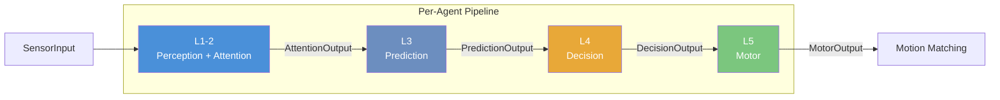

# Social Crowd Simulation: Improving Realism with Social Rules and Gaze Behavior (MIG2024, C&G2025)

Welcome to the **Social Crowd Simulation** repository. This system simulates dynamic pedestrian movement by integrating social forces, group behavior, gaze control, and motion matching animation.

- Steer toward goals with social force model
- Avoid collisions (urgent avoidance + anticipated collision)
- Form natural groups (cohesion, repulsion, alignment)
- Realistic attention model with gaze behavior
- Natural animation by [motion matching](https://github.com/JLPM22/MotionMatching)

For a detailed overview and demo, visit the [Project Page](https://reiyaitatani.github.io/SocialCrowdSimulation/).
For the paper: [MIG2024](https://dl.acm.org/doi/10.1145/3677388.3696337) | [Computers & Graphics 2025](https://www.sciencedirect.com/science/article/pii/S009784932500127X)


---

## Documentation

Full documentation is available in the [Wiki](docs/wiki/Home.md).

| Page | Description |
|------|-------------|
| [Installation](docs/wiki/Installation.md) | Prerequisites and Unity Package Manager setup |
| [Quick Start](docs/wiki/Quick-Start.md) | Step-by-step demo scene setup |
| [First-Person Camera](docs/wiki/First-Person-Camera.md) | Adding a controllable player |
| [Environment Setup](docs/wiki/Environment-Setup.md) | Walls and obstacles |
| [Agent Manager](docs/wiki/Agent-Manager.md) | Force weights, motion matching parameters, debug gizmos |
| [Architecture Overview](docs/wiki/Architecture-Overview.md) | 5-layer pipeline design and data flow |
| [Pipeline Layers](docs/wiki/Pipeline-Layers.md) | Detailed L1-2, L3, L4, L5 documentation |
| [Data Contracts](docs/wiki/Data-Contracts.md) | All `readonly struct` types |
| [Group System](docs/wiki/Group-System.md) | Group management, shared FOV, group collider |
| [Animation and Gaze](docs/wiki/Animation-and-Gaze.md) | Social behavior and gaze controller |
| [Customization](docs/wiki/Customization.md) | How to swap pipeline layers |

---

## Quick Install

1. Open Unity (2021.2+)
2. **Window > Package Manager > Add (+) > Add package by git URL...**
3. Enter:
   ```
   https://github.com/ReiyaItatani/SocialCrowdSimulation.git?path=Assets/com.reiya.socialcrowdsimulation
   ```

> All sample scenes use **URP**. Convert materials if using a different pipeline.

For detailed setup, see [Installation](docs/wiki/Installation.md) and [Quick Start](docs/wiki/Quick-Start.md).

---

## Architecture

The steering system uses a **5-layer pipeline** architecture with immutable data contracts:



| Layer | Default Implementation | Role |
|-------|----------------------|------|
| **L1-2** | `DefaultPerceptionAttentionLayer` | Resolves GameObjects to `PerceivedAgent` structs (only `GetComponent` boundary) |
| **L3** | `DefaultPredictionLayer` | Linear extrapolation of neighbor positions |
| **L4** | `DefaultDecisionLayer` | Social Force Model: 6 weighted forces |
| **L5** | `DefaultMotorLayer` | Speed management, goal slowing |

Each layer is interface-based and swappable. See [Architecture Overview](docs/wiki/Architecture-Overview.md) and [Customization](docs/wiki/Customization.md) for details.

---

## Contributions

We encourage contributions and inquiries — please **open an issue** or submit a **pull request** if you wish to collaborate or have questions.

---

## Citation

If you find this work beneficial, kindly cite the following:

```bibtex
@article{Reiya2025,
title = {Social crowd simulation: Improving realism with social rules and gaze behavior},
journal = {Computers & Graphics},
volume = {131},
pages = {104286},
year = {2025},
issn = {0097-8493},
doi = {https://doi.org/10.1016/j.cag.2025.104286},
url = {https://www.sciencedirect.com/science/article/pii/S009784932500127X},
author = {Reiya Itatani and Nuria Pelechano},
keywords = {Crowd simulation, Collision avoidance, Gaze behavior, Social rules}
}
}
```
