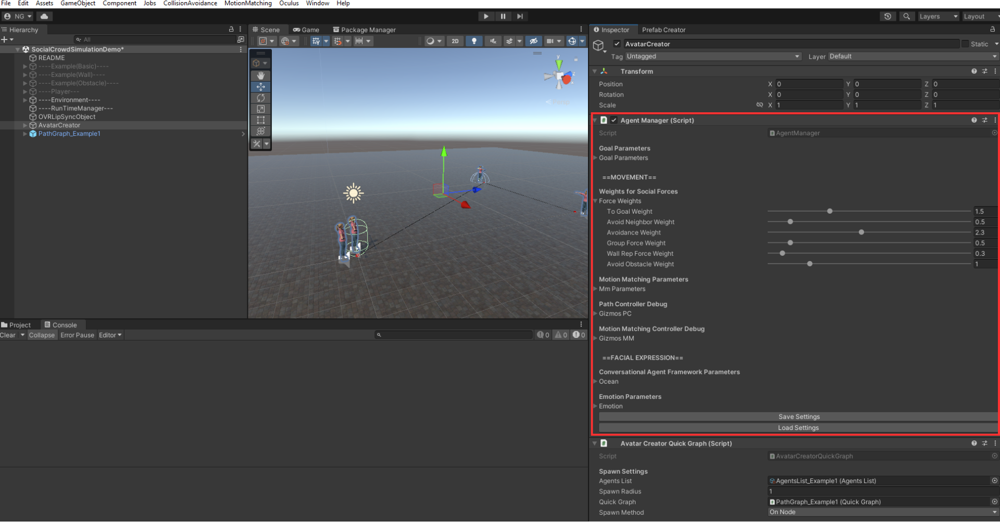

# Agent Manager

Centralized parameter panel on the **AvatarCreator** GameObject. Changes apply to all agents in real-time.



---

## Force Weights

**L4 (Decision Layer)** combines 6 forces into the agent's desired direction:

```
DesiredDirection = normalize(
    ToGoal       * w₁  +
    Avoidance    * w₂  +
    Anticipated  * w₃  +
    Group        * w₄  +
    Wall         * w₅  +
    Obstacle     * w₆
)
```

Each weight (w) controls how strongly that force influences the final direction. The weights below are the default values:

| Weight | Default | Force | Description |
|--------|---------|-------|-------------|
| `toGoalWeight` | 1.5 | **ToGoal** | Steers agent toward its current goal position |
| `avoidNeighborWeight` | 0.5 | **Avoidance** | Evades agents in the immediate avoidance area |
| `avoidanceWeight` | 2.3 | **Anticipated Collision** | Avoids predicted future collisions with neighbors |
| `groupForceWeight` | 0.5 | **Group** | Maintains group formation (cohesion + repulsion + alignment) |
| `wallRepForceWeight` | 0.3 | **Wall** | Repulsion from walls (`Wall` tagged objects) |
| `avoidObstacleWeight` | 1.0 | **Obstacle** | Avoidance of obstacles (`Obstacle` tagged objects) |

Each force is described in detail in the papers: [MIG2024](https://dl.acm.org/doi/10.1145/3677388.3696337) / [Computers & Graphics 2025](https://www.sciencedirect.com/science/article/pii/S009784932500127X).

---

## Goal Parameters

| Parameter | Default | Range |
|-----------|---------|-------|
| `goalRadius` | 2.0 | 0.1 - 5.0 |
| `slowingRadius` | 3.0 | 0.1 - 5.0 |

---

## Motion Matching Parameters

| Parameter | Default |
|-----------|---------|
| `MaxDistanceMMAndCharacterController` | 0.1 |
| `PositionAdjustmentHalflife` | 0.1 |
| `PosMaximumAdjustmentRatio` | 0.1 |

---

## Debug Gizmos

### Path Controller
| Toggle | |
|--------|-|
| `ShowAvoidanceForce` | Urgent avoidance vector |
| `ShowAnticipatedCollisionAvoidance` | Anticipated collision vector |
| `ShowGoalDirection` | Goal direction |
| `ShowCurrentDirection` | Current movement direction |
| `ShowGroupForce` | Group force vector |
| `ShowWallForce` | Wall repulsion vector |
| `ShowObstacleAvoidanceForce` | Obstacle avoidance vector |

### Motion Matching
| Toggle | |
|--------|-|
| `DebugSkeleton` | Skeleton visualization |
| `DebugCurrent` | Current pose |
| `DebugPose` | Target pose |
| `DebugTrajectory` | Predicted trajectory |
| `DebugContacts` | Contact points |

---

## Save / Load Settings

Export/import all parameters as JSON via the Inspector buttons.

---

Next: [Pipeline](Pipeline.md)
