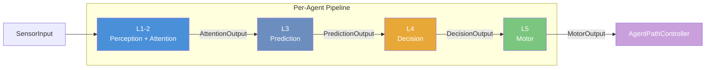
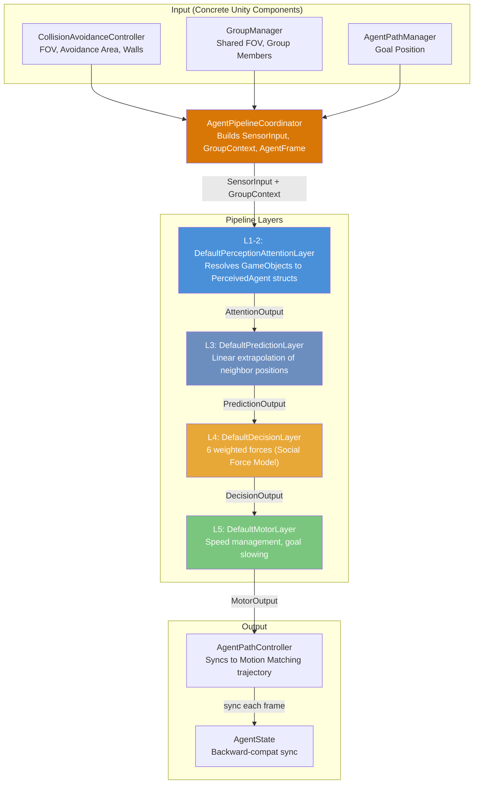
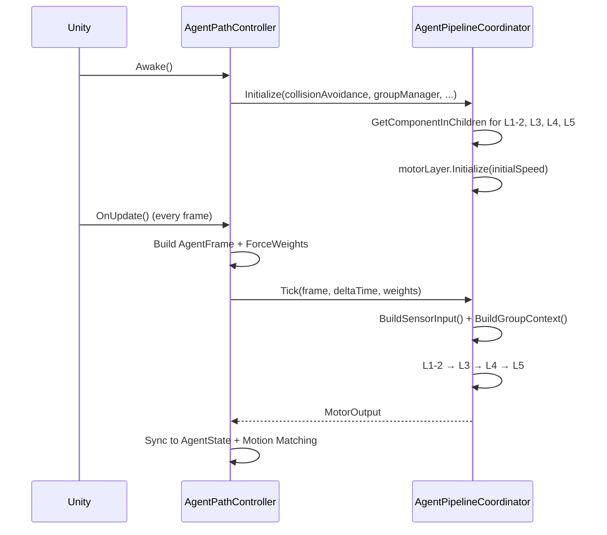
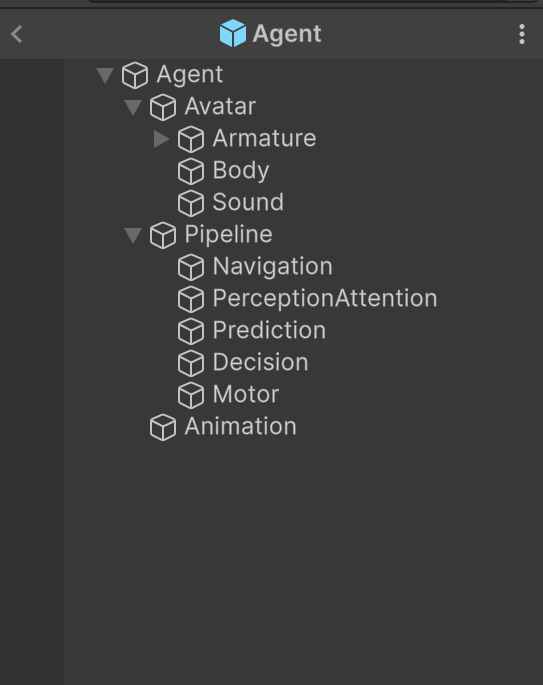

# Architecture Overview

The steering system uses a **layered pipeline** architecture. Each agent runs a 5-layer Perception-to-Action pipeline every frame, orchestrated by `AgentPipelineCoordinator`. All inter-layer communication uses **immutable `readonly struct` data contracts**.

## Pipeline Overview

## Design Principles

### Immutable Data Flow
Every struct passed between layers is `readonly`. No layer can mutate another layer's output. This makes the data flow predictable and easy to debug.

### GetComponent Boundary
Only **L1-2** calls `GetComponent` on neighboring agents. It resolves raw `GameObject` lists into `PerceivedAgent` structs. Downstream layers (L3, L4, L5) receive pure data — no Unity API calls needed. This makes them easy to unit test and swap.

### Interface-Based Layers
Each layer implements an interface:
- `IPerceptionAttentionLayer` (L1-2)
- `IPredictionLayer` (L3)
- `IDecisionLayer` (L4)
- `IMotorLayer` (L5)

You can replace any layer with a custom implementation. See [Customization](Customization.md).

### Coordinator Pattern
`AgentPipelineCoordinator` is the only component that touches concrete Unity components (CollisionAvoidanceController, GroupManager, NormalVector). It builds input structs and passes them through the pipeline. No layer has direct references to Unity MonoBehaviour components.

## Full Data Flow

## Initialization Order

## Agent Prefab Hierarchy

Each layer lives on its own child GameObject under `Pipeline/`:
- **Navigation** — `AgentPathManager`
- **PerceptionAttention** — `CollisionAvoidanceController` + `DefaultPerceptionAttentionLayer`
- **Prediction** — `DefaultPredictionLayer`
- **Decision** — `DefaultDecisionLayer`
- **Motor** — `DefaultMotorLayer`

## Key Files

| File | Role |
|------|------|
| `AgentPipelineCoordinator.cs` | Orchestrator — runs pipeline per tick |
| `IPipelineLayer.cs` | Interface definitions for all 4 layers |
| `PipelineContracts.cs` | All `readonly struct` data contracts |
| `AgentPathController.cs` | Per-agent driver, bridges pipeline with Motion Matching |
| `BasePathController.cs` | Motion Matching integration base class |
| `PredictionMath.cs` | Shared collision prediction math |
| `TimedForce.cs` | Smooth force transition utility |

---

Next: [Pipeline Layers](Pipeline-Layers.md) | [Data Contracts](Data-Contracts.md)
