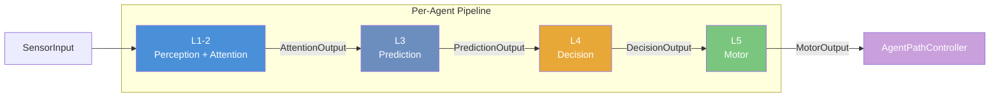
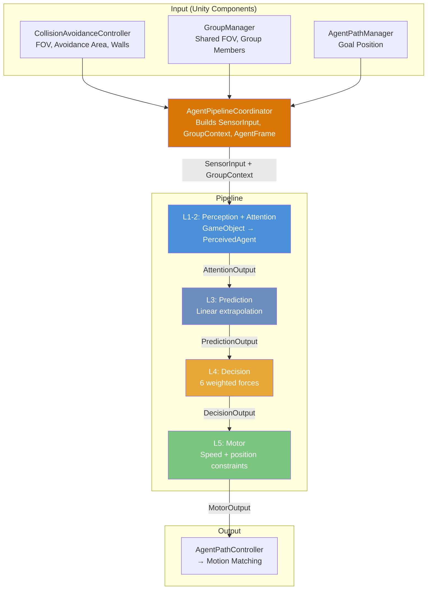
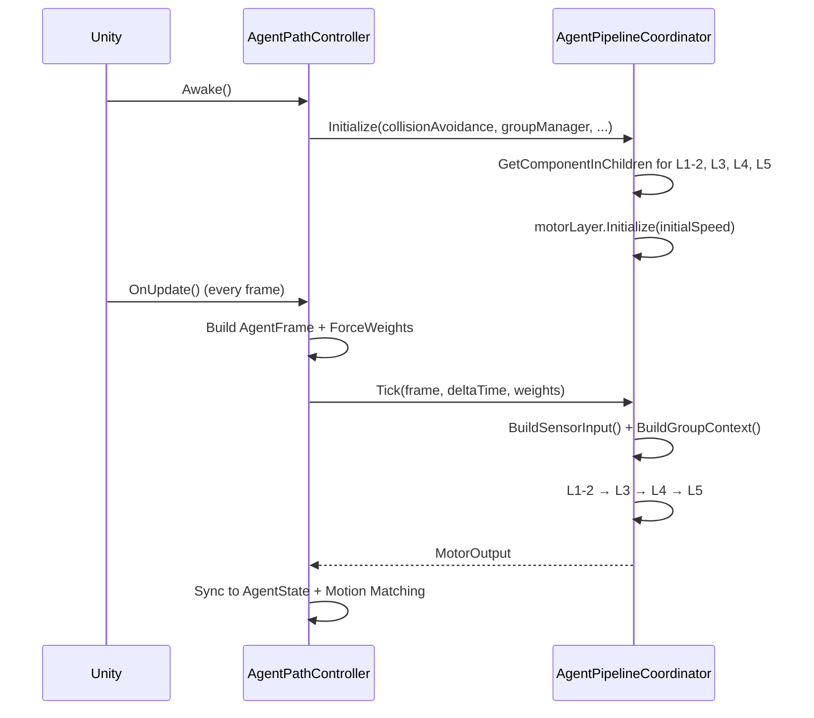

# Architecture Overview

Each agent runs a **5-layer pipeline** every frame, orchestrated by `AgentPipelineCoordinator`. All inter-layer communication uses **immutable `readonly struct` data contracts**.

---

## Pipeline



---

## Design Principles

| Principle | |
|-----------|---|
| **Immutable Data** | All structs are `readonly`. No layer mutates another's output |
| **GetComponent Boundary** | Only L1-2 calls `GetComponent`. Downstream layers receive pure data |
| **Interface-Based** | Each layer implements an interface — swap any layer freely |
| **Coordinator Pattern** | Only `AgentPipelineCoordinator` touches concrete Unity components |

---

## Data Flow



---

## Initialization



---

## Agent Prefab Hierarchy

<!-- TODO: images/agent-prefab-hierarchy.png — Unity Hierarchy showing Agent prefab with Pipeline children -->

```
Agent (tag="Agent")
  Avatar/
    Rigidbody, CapsuleCollider
    ParameterManager, SocialBehaviour, GazeController
    MotionMatchingSkinnedMeshRenderer
  Pipeline/
    AgentPathController, AgentPipelineCoordinator
    Navigation/          → AgentPathManager
    PerceptionAttention/ → CollisionAvoidanceController + DefaultPerceptionAttentionLayer
    Prediction/          → DefaultPredictionLayer
    Decision/            → DefaultDecisionLayer
    Motor/               → DefaultMotorLayer
  Animation/
    MotionMatchingController
```

---

## Key Files

| File | Role |
|------|------|
| `AgentPipelineCoordinator.cs` | Runs pipeline per tick |
| `IPipelineLayer.cs` | Interface definitions |
| `PipelineContracts.cs` | All `readonly struct` contracts |
| `AgentPathController.cs` | Bridges pipeline ↔ Motion Matching |
| `PredictionMath.cs` | Collision prediction math |
| `TimedForce.cs` | Smooth force transitions |

---

Next: [Pipeline Layers](Pipeline-Layers.md) | [Data Contracts](Data-Contracts.md)
