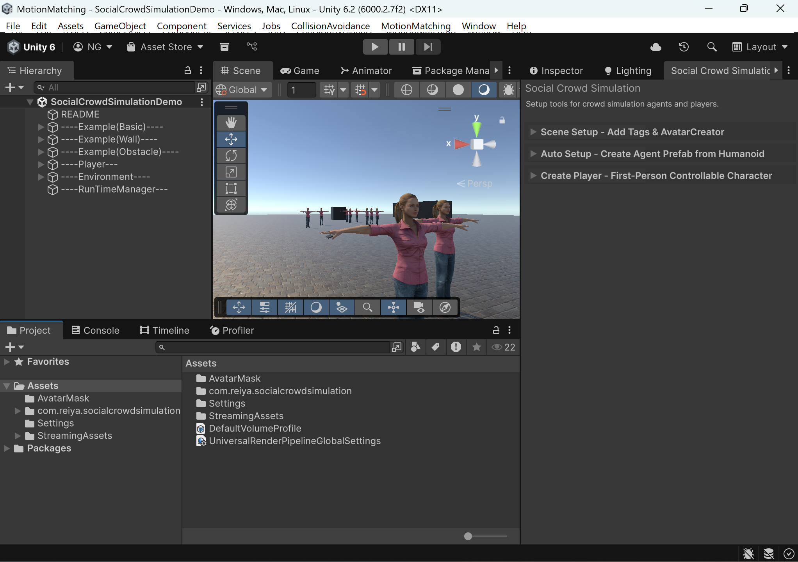

# Editor Window

**CollisionAvoidance > Social Crowd Simulation**

---

## Scene Setup

Creates an **AvatarCreator** GameObject and adds required tags (`Agent`, `Group`, `Wall`, `Object`, `Obstacle`).

Click **Create AvatarCreator** — run once per scene.

---

## Auto Setup

Converts Humanoid models into agent prefabs.

### Steps

1. Drag Humanoid model(s) into the **drop zone**
2. Prefab saved to `Assets/Resources/<ModelName>/Agent.prefab`

Default assets auto-load from `Sample/QuickStart/ForPrefabCreator/`. Expand **Advanced Settings** to override:

| Asset | |
|-------|-|
| Motion Matching Data | Animation database |
| Animator Controller | State machine |
| FOV Mesh | Field-of-view detection |
| Avatar Mask | Upper body animation mask |
| SmartPhone Mesh | Phone prop model |
| Audio Clips | Agent voice lines |

### Validation

- Model must have **Animator** component
- Animator rig must be **Humanoid**
- Status banner: Green = ready, Yellow = missing assets

---

## Create Player

Adds a first-person controllable player.

### Steps

1. Assign **Motion Matching Data** — use `Sample/QuickStart/ForPlayerCreator/MotionMatchingData.asset`
2. Assign **Humanoid Avatar** — any humanoid model
3. Click **Create Player**

### Controls

| Key | Action |
|-----|--------|
| **WASD** | Move |

---

Next: [Environment Setup](Environment-Setup.md)
