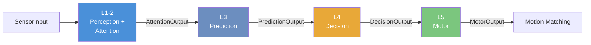
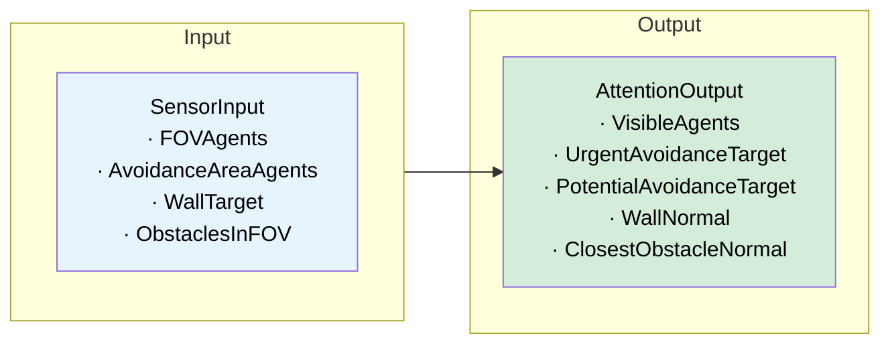
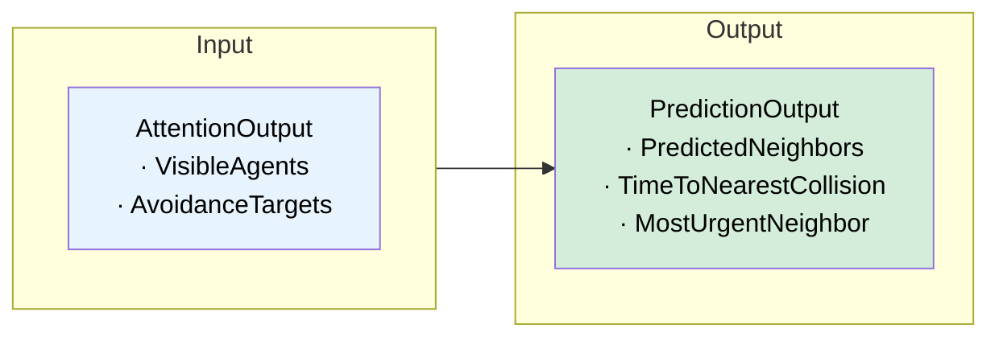
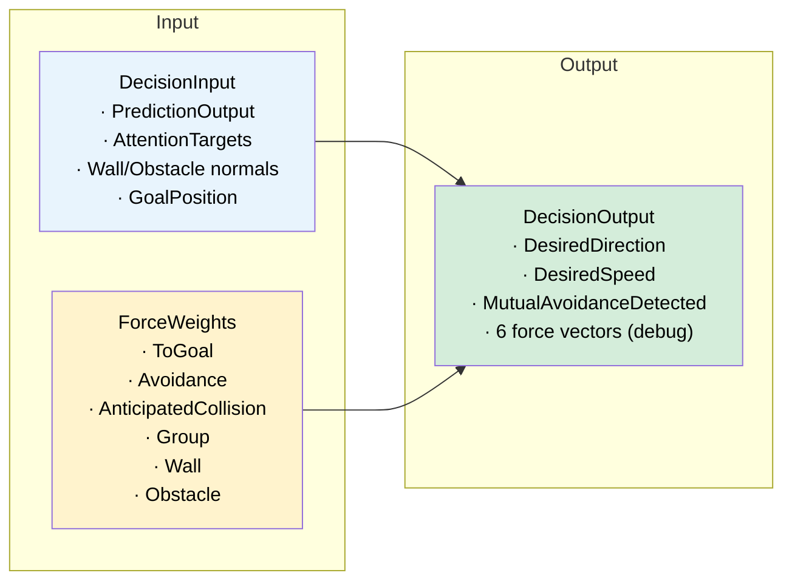
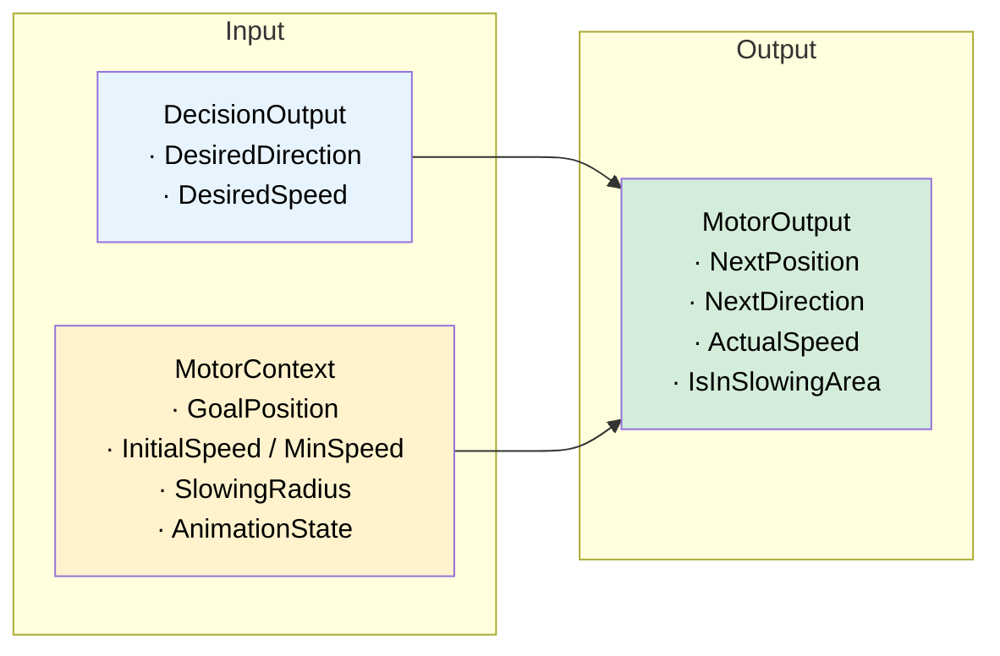

# Pipeline

Each agent runs a **5-layer pipeline** every frame. All layers communicate via immutable `readonly struct` data.

---

## Overview

All layers also receive **AgentFrame** (Position, Direction, Speed) and **GroupContext** (group membership info).

---

## Layer I/O

### L1-2: Perception + Attention

The only layer that reads Unity components from neighbors. Everything downstream is pure data.

---

### L3: Prediction

Linear extrapolation of neighbor positions to predict future collisions.

---

### L4: Decision

Combines **6 weighted forces** into a desired direction and speed.

ForceWeights are configured in [Agent Manager](Agent-Manager.md).

---

### L5: Motor

Applies speed limits, goal slowing, and group speed adjustments.

---

## Interfaces

| Layer | Interface |
|-------|-----------|
| L1-2 | `IPerceptionAttentionLayer` |
| L3 | `IPredictionLayer` |
| L4 | `IDecisionLayer` |
| L5 | `IMotorLayer` |

Each layer can be swapped — see [Customization](Customization.md).

---

Back to: [Home](Home.md)
