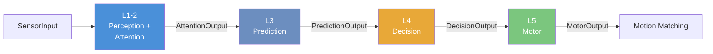
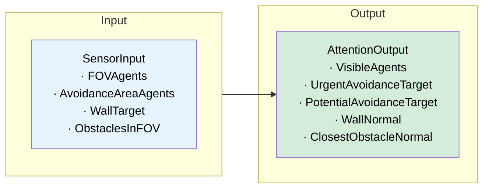
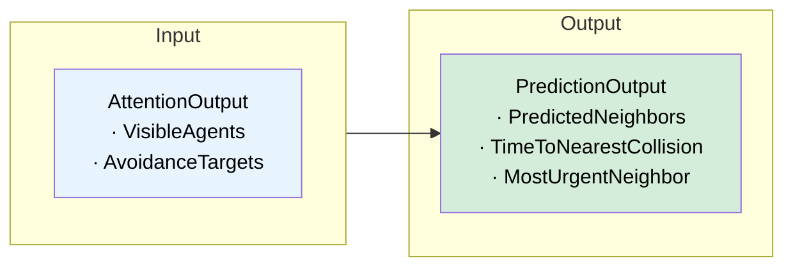
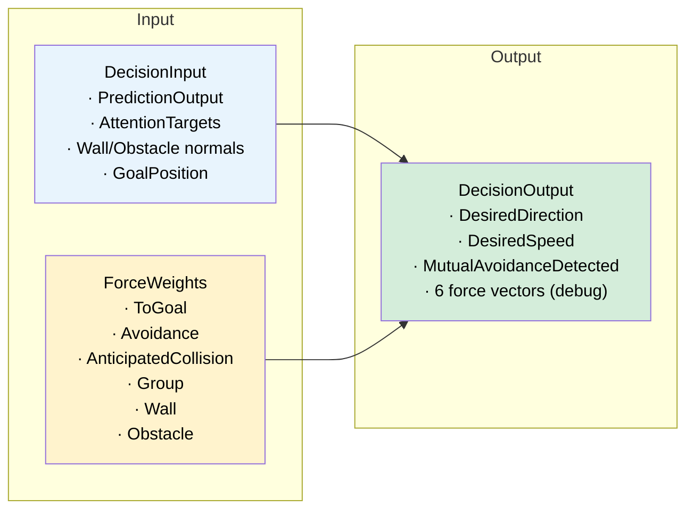
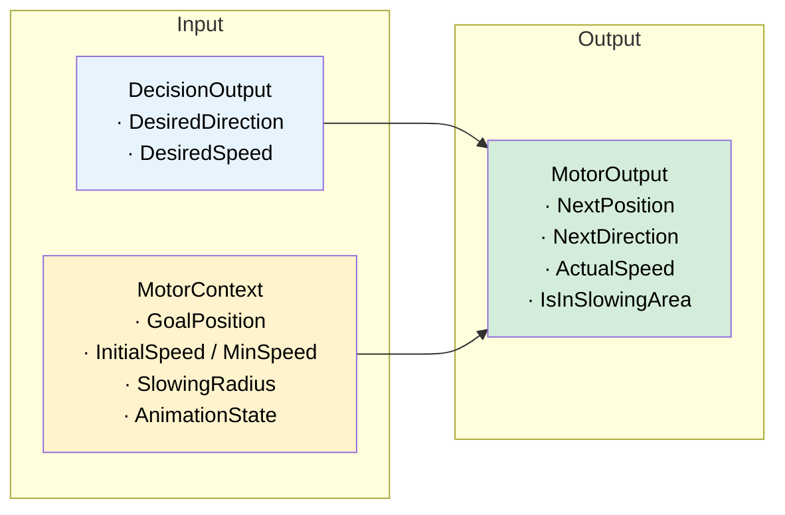

# Pipeline

Each agent runs a **5-layer pipeline** every frame. All layers communicate via immutable `readonly struct` data.

## Why This Design

This pipeline mirrors how humans actually navigate crowds:

1. **Perceive** — see who is around you (L1-2)
2. **Predict** — anticipate where they are heading (L3)
3. **Decide** — choose which direction to go (L4)
4. **Act** — move your body (L5)

Each layer corresponds to a stage of this cognitive process. Because each stage is a separate interface, you can replace any one algorithm (e.g., swap the decision model from Social Force to ORCA) without affecting the others.

---

## Overview



All layers also receive **AgentFrame** (Position, Direction, Speed) and **GroupContext** (group membership info).

---

## Layer I/O

### L1-2: Perception + Attention

The only layer that reads Unity components from neighbors. Everything downstream is pure data.



---

### L3: Prediction

Linear extrapolation of neighbor positions to predict future collisions.



---

### L4: Decision

Combines **6 weighted forces** into a desired direction and speed.



ForceWeights are configured in [Agent Manager](Agent-Manager).

---

### L5: Motor

Applies speed limits, goal slowing, and group speed adjustments.



---

## Customization

Each layer is defined by an interface. Implement it, attach to the correct child GameObject, and it works automatically.

| Layer | Interface | Child GameObject |
|-------|-----------|-----------------|
| L1-2 | `IPerceptionAttentionLayer` | `Pipeline/PerceptionAttention/` |
| L3 | `IPredictionLayer` | `Pipeline/Prediction/` |
| L4 | `IDecisionLayer` | `Pipeline/Decision/` |
| L5 | `IMotorLayer` | `Pipeline/Motor/` |

### How to Swap

1. Open agent prefab → find `Pipeline/<LayerName>/`
2. Remove or disable the default component
3. Add your component

The coordinator resolves via `GetComponentInChildren<T>()` — no other changes needed.

### Example: Custom Decision Layer

```csharp
public class ORCADecisionLayer : MonoBehaviour, IDecisionLayer
{
    public DecisionOutput Tick(DecisionInput input, AgentFrame frame,
        ForceWeights weights, GroupContext group, float deltaTime)
    {
        Vector3 desiredDirection = ComputeORCA(input, frame, weights);

        return new DecisionOutput(
            desiredDirection, frame.Speed,
            false, null,
            Vector3.zero, Vector3.zero, Vector3.zero,
            Vector3.zero, Vector3.zero, Vector3.zero
        );
    }
}
```

Set debug force vectors to `Vector3.zero` if not needed.

---

Next: [Agent Manager](Agent-Manager)
