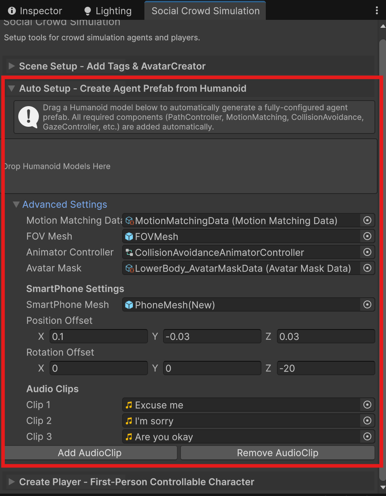

# Quick Start

[YouTube Tutorial](https://youtu.be/U8zkxdCCsnY) | Demo scene: `Sample/SocialCrowdSimulationDemo.unity`

---

## Step 0: Create Agent Prefabs

**CollisionAvoidance > Social Crowd Simulation** > **Auto Setup**

Drag and drop Humanoid models into the drop zone. Agent prefabs are saved to `Assets/Resources/<ModelName>/Agent.prefab`.

Default assets are auto-loaded from `Sample/QuickStart/ForPrefabCreator/`. Expand **Advanced Settings** to override.

---

## Step 1: Define the Crowd

**Create > SocialCrowdSimulation > Agent List** (or use `Sample/QuickStart/ForAvatarCreator/AgentsList_Example`)

| Field | Description |
|-------|-------------|
| **Individual** | Solo walking agents + speed range |
| **Group** | 2-3 agents walking together. Unique `groupName` required |

---

## Step 2: Scene Setup

**CollisionAvoidance > Social Crowd Simulation** > **Scene Setup** > **Create AvatarCreator**

This creates an **AvatarCreator** GameObject with `AgentManager` + `AvatarCreatorQuickGraph`.

---

## Step 3: Path Setup & Spawn

### 3.1 Place a PathGraph

Drag a PathGraph from `Sample/QuickStart/ForAvatarCreator/` into the scene.

### 3.2 Configure & Instantiate

1. Assign **AgentsList** and **QuickGraph** on the AvatarCreator
2. Set **SpawnRadius** and **SpawnMethod** (OnNode / OnEdge)
3. **Bake NavMesh** (Window > AI > Navigation)
4. Click **Instantiate Avatars**

---

## Step 4: Run

Press **Play**.

---

Next: [Editor Window](Editor-Window.md)
