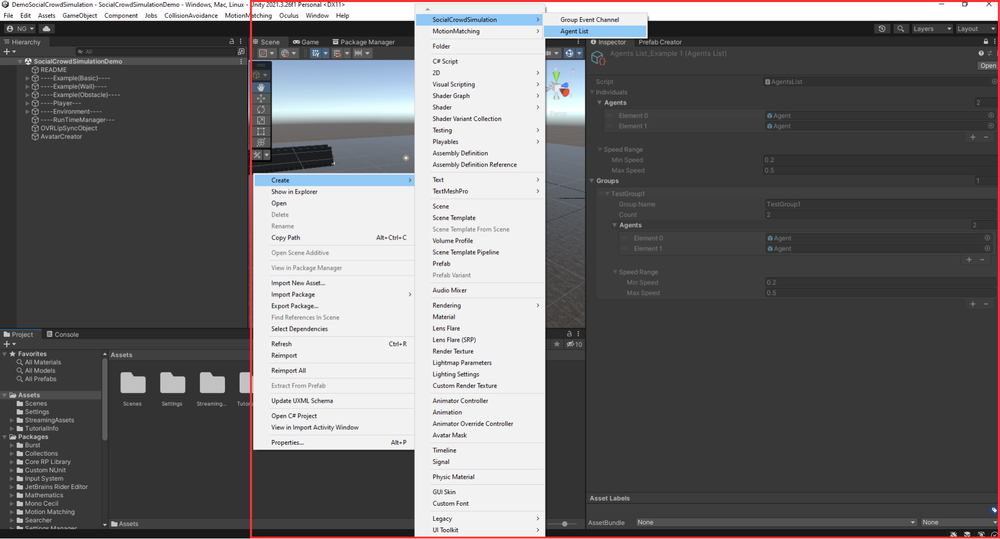
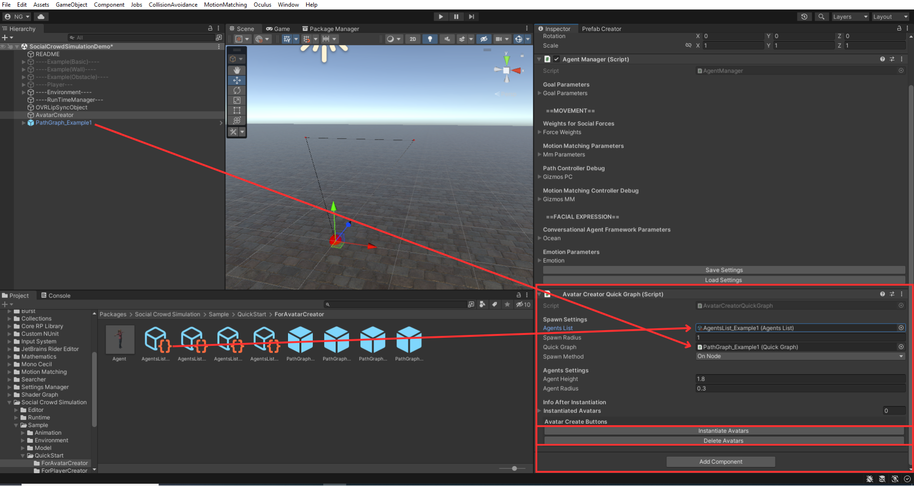

# Quick Start: Demo Scene Setup

A video walkthrough is available: [YouTube Tutorial](https://youtu.be/U8zkxdCCsnY)

To quickly start, there is a demo scene inside `Packages/SocialCrowdSimulation/Sample` — use it directly.

---

## Step 0: Prepare a Humanoid Character

1. In the **CollisionAvoidance** tab, click **PrefabCreator**
2. Everything required for setup is in `Packages/SocialCrowdSimulation/Sample/QuickStart/PrefabCreator`
3. Drag and drop a Humanoid Character — it will automatically create an Agent in the **Resources** folder

### Avatar-Specific Settings

- If you are **not** using MicroSoftRocketBoxAvatar or AvatarSDK avatars, **uncheck** the "Yes" box to prevent blend shape scripts from attaching incorrectly
- For **MicroSoftRocketBoxAvatar**: open **CollisionAvoidance** tab > **Target Framework** > **RocketBox Avatar**
- For **Avatar SDK**: open **CollisionAvoidance** tab > **Target Framework** > **Avatar SDK**

---

## Step 1: Define the Crowd

1. In the **Project** window, right-click and select **Create > SocialCrowdSimulation > AgentList** (or use the example in `Packages/SocialCrowdSimulation/Sample/QuickStart/ForAvatarCreator`)
2. Configure agents:
   - **Individual**: An agent walking alone
   - **Group**: Agents walking together (2-3 members recommended)
   - **maxSpeed / minSpeed**: Speed range for each agent
   - **Group Names** must be unique. Do not use "Individual" as a group name

---

## Step 2: Create GameObjects for Avatar Creation

1. In the **CollisionAvoidance** tab, click **Create AvatarCreator**
2. This adds tags (**Agent**, **Group**, **Wall**, **Obstacle**) and creates two GameObjects:
   - **OVRLipSyncObject**: Required for lip sync
   - **AgentCreator**: Contains:
     - **AgentManager** — parameter management for all agents
     - **AvatarCreatorQuickGraph** — spawns avatars in the scene

---

## Step 3: Path Setup and Agent Instantiation

### 3.1 Set Up Paths

- Use examples under `Packages/SocialCrowdSimulation/Sample/QuickStart/ForAvatarCreator`
- Place a **PathGraph_Example** asset in your scene
- Paths are defined by connecting nodes — agents follow these paths

### 3.2 Configure and Spawn

1. Assign your **AgentList** to `AvatarCreatorQuickGraph`
2. Assign the **Path** to `AgentCreator`
3. Configure spawn settings:
   - **SpawnRadius**: How scattered agents are when spawning
   - **SpawnMethod**:
     - **OnNode**: Spawns around selected nodes
     - **OnEdge**: Spawns on edges between nodes
4. **Bake the NavMesh** before instantiation
5. Click **Instantiate Avatar** to create agents

---

## Step 4: Run the Simulation

Press **Play**. Agents will begin moving according to social force rules, avoiding collisions, forming groups, and exhibiting natural gaze behavior.

---

Next: [First-Person Camera](First-Person-Camera.md) | [Agent Manager](Agent-Manager.md)
